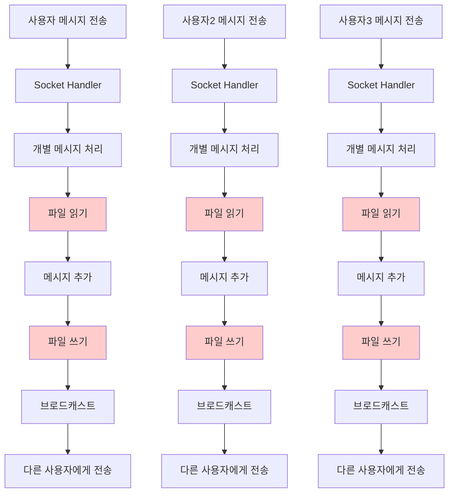
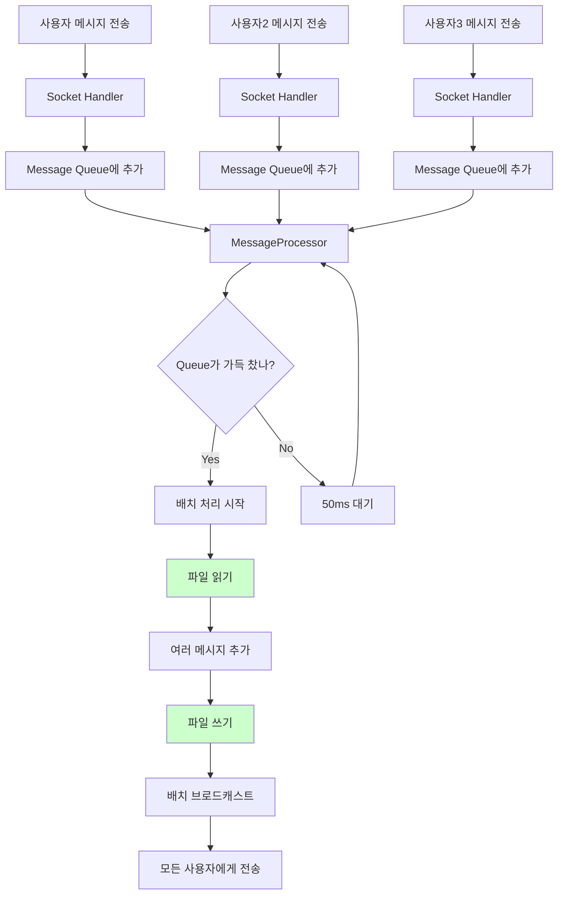

# 🚀 Final Performance Challenge: Solution Guide

## 📋 문제 상황

### 🔍 현재 상황 확인

1. **대량 메시지 부하 테스트 실행**
   ```bash
   kubectl exec -it minitalk-loadtest-7fdc87d54-45sqp -n jonny -- python new_year_load_test.py
   ```

2. **프론트엔드에서 문제 확인**
   - 브라우저에서 MinitalkChat 접속
   - 채팅방에서 메시지 전송 시도
   - **발견된 문제**: 메시지가 지연되거나 전송되지 않음

### 🔍 코드 분석 결과

`backend/ws/socketHandler.js`에서 메시지 처리 방식을 확인하면:

```javascript
// 현재 문제가 있는 코드
socket.on('send_message', async (data) => {
  // 각 메시지마다 개별적으로 처리
  const savedMessage = await dataManager.createMessage(messageData);
  io.to(roomId).emit('message', { ... });
});
```

**문제점:**
- 메시지 하나씩 파일에 저장 (파일 I/O 병목)
- 대량 요청 시 파일 락 경합 발생
- 메시지 전송이 지연되거나 실패

## 💡 해결 방안

### 🎯 핵심 아이디어: 배치 처리

개별 메시지 처리 대신 **여러 메시지를 모아서 한 번에 처리**하는 방식으로 변경

## 🔧 구현 단계

### Step 1: MessageProcessor 클래스 구현

`backend/ws/socketHandler.js`에 다음 클래스를 추가:

```javascript
class MessageProcessor {
  constructor() {
    this.messageQueue = [];
    this.processing = false;
    this.batchSize = 100; // 100개씩 배치 처리
    this.flushInterval = 50; // 50ms마다 처리
    
    this.startBatchProcessor();
  }
  
  // 메시지를 큐에 추가
  queueMessage(messageData) {
    this.messageQueue.push(messageData);
    
    // 큐가 가득 차면 즉시 처리
    if (this.messageQueue.length >= this.batchSize) {
      this.flushMessages();
    }
  }
  
  // 주기적으로 배치 처리
  startBatchProcessor() {
    setInterval(() => {
      if (this.messageQueue.length > 0) {
        this.flushMessages();
      }
    }, this.flushInterval);
  }
  
  // 배치로 메시지 처리
  async flushMessages() {
    if (this.processing || this.messageQueue.length === 0) return;
    
    this.processing = true;
    const batch = this.messageQueue.splice(0, this.batchSize);
    
    try {
      // 배치로 데이터베이스에 저장
      const savedMessages = await dataManager.createMessagesBatch(batch);
      
      // 배치로 브로드캐스트
      batch.forEach((msgData, index) => {
        msgData.io.to(msgData.roomId).emit('message', {
          type: 'message',
          roomId: msgData.roomId,
          sender: msgData.sender,
          content: msgData.content,
          timestamp: savedMessages[index].timestamp
        });
      });
    } catch (error) {
      console.error('Batch processing error:', error);
    } finally {
      this.processing = false;
    }
  }
}
```

### Step 2: 소켓 핸들러 수정

`backend/ws/socketHandler.js`의 소켓 이벤트 핸들러를 수정:

```javascript
const messageProcessor = new MessageProcessor();

socket.on('send_message', async (data) => {
  try {
    const { roomId, content } = data;
    const sender = socket.userId;
    
    // 검증 로직...
    
    // 배치 처리를 위해 큐에 추가
    messageProcessor.queueMessage({
      roomId,
      sender,
      content,
      timestamp: new Date().toISOString(),
      io: io
    });
    
    // 즉시 응답 (실제 처리는 백그라운드에서)
    
  } catch (error) {
    socket.emit('error', { message: 'Failed to send message' });
  }
});
```

### Step 3: DataManager에 배치 메서드 추가

`backend/data/dataManager.js`에 다음 메서드를 추가:

```javascript
async createMessagesBatch(messagesData) {
  const currentFile = this.getCurrentMessageFile();
  return this.queueFileOperation(currentFile, async () => {
    let activeFile = this.getCurrentMessageFile();
    let messages = await this.readFile(activeFile);
    
    const newMessages = messagesData.map(messageData => ({
      id: Date.now().toString() + Math.random().toString(36).substr(2, 9),
      roomId: messageData.roomId,
      sender: messageData.sender,
      content: messageData.content,
      timestamp: messageData.timestamp || new Date().toISOString(),
      createdAt: new Date().toISOString()
    }));

    // 배치로 메시지 추가
    for (const newMessage of newMessages) {
      if (messages.length >= this.maxMessagesPerFile) {
        await this.writeFile(activeFile, messages);
        await this.createNewMessageFile();
        activeFile = this.getCurrentMessageFile();
        messages = [];
      }
      messages.push(newMessage);
    }
    
    // 최종 파일 저장
    await this.writeFile(activeFile, messages);
    
    return newMessages;
  });
}
```

## ✅ 검증 단계

### Step 1: 대량 메시지 부하 테스트 재실행
```bash
kubectl exec -it minitalk-loadtest-7fdc87d54-45sqp -n jonny -- python new_year_load_test.py
```

### Step 2: 프론트엔드에서 개선 효과 확인
1. 브라우저에서 MinitalkChat 접속
2. 채팅방에서 메시지 전송 시도
3. **개선 확인**: 메시지가 정상적으로 전송되는지 확인

## 📊 개선 효과

### Before vs After

| 항목 | Before | After |
|------|--------|-------|
| 메시지 전송 | 지연/실패 | 정상 전송 |
| 파일 I/O | 메시지당 1회 | 배치당 1회 |
| 응답 시간 | 증가 | 일정 |
| 동시성 | 락 경합 | 순차 처리 |

## 📊 데이터 흐름 비교

### Before: 개별 처리 방식



**문제점:**
- 각 메시지마다 파일 I/O 발생 (빨간색)
- 동시 요청 시 파일 락 경합
- 처리 시간 증가

### After: 배치 처리 방식



**개선점:**
- 여러 메시지를 모아서 한 번에 파일 I/O (초록색)
- 파일 락 경합 해결
- 처리 시간 단축

**성공적인 성능 최적화를 위해 단계별로 구현하고 검증하세요! 🚀**
