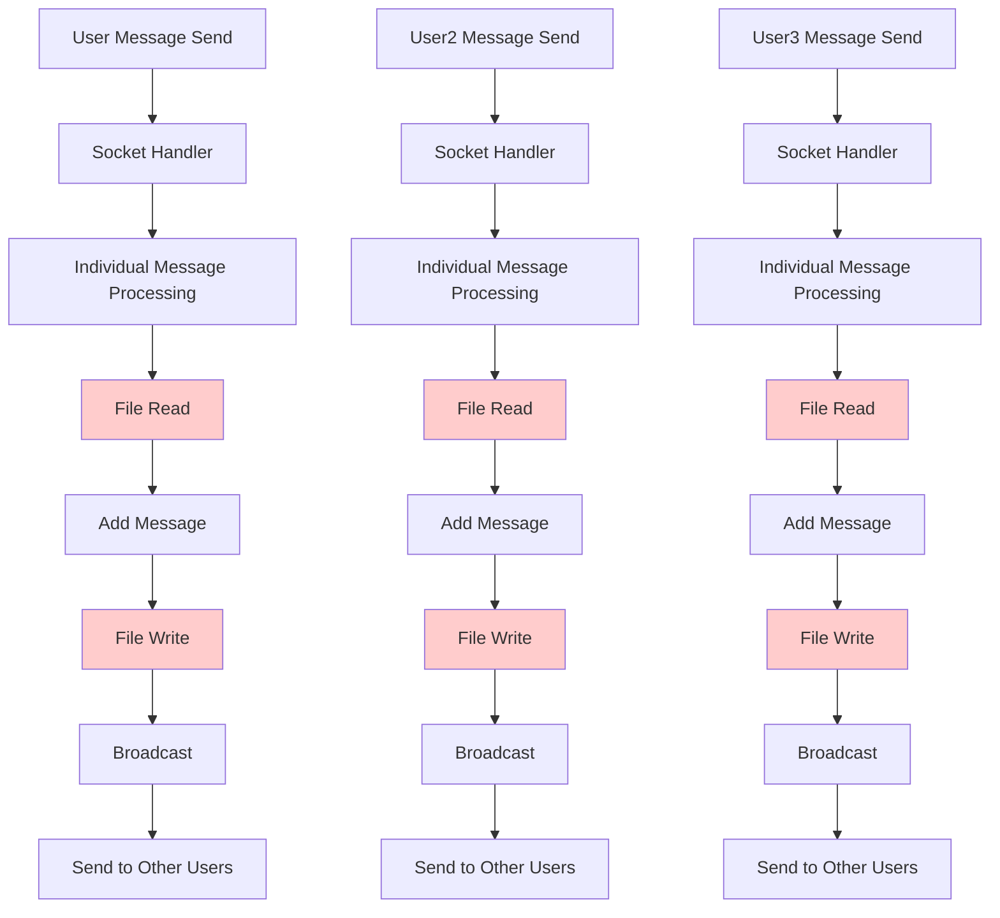
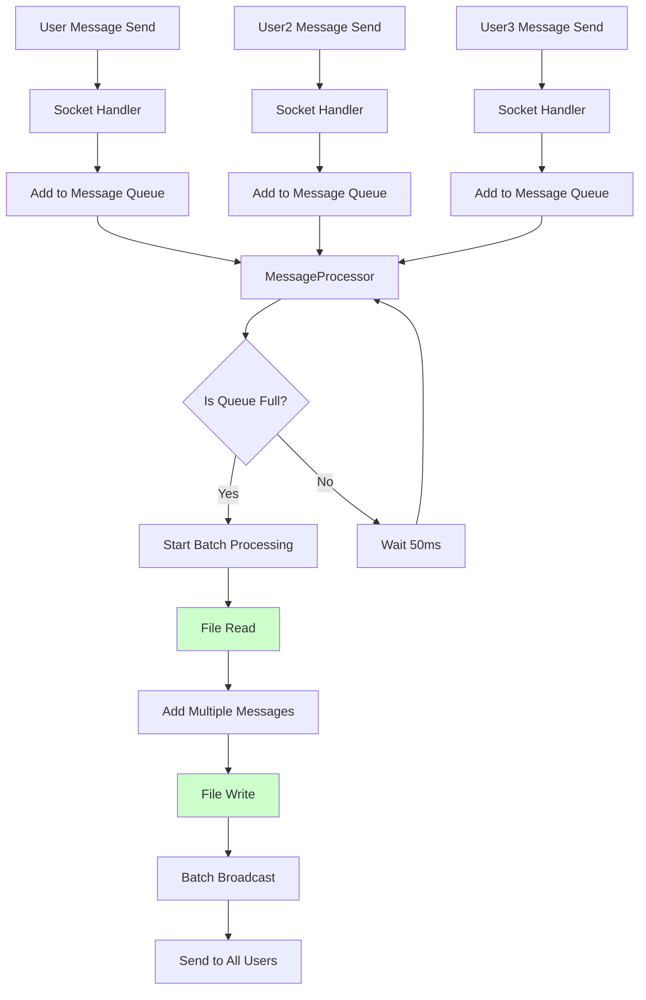
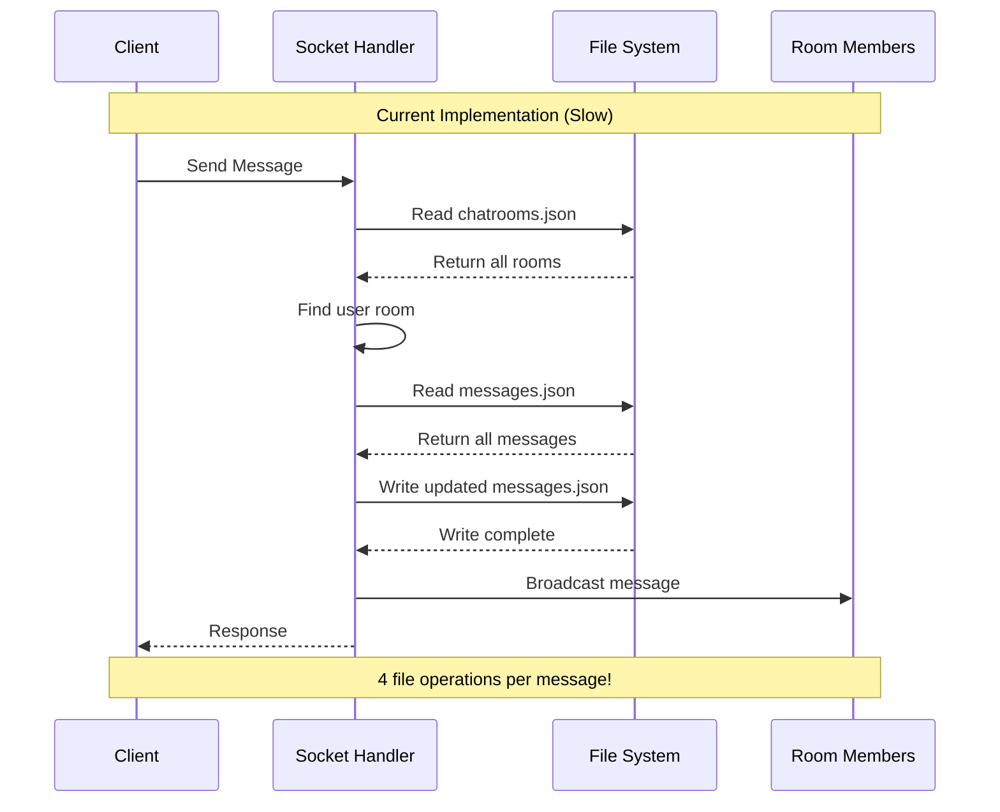
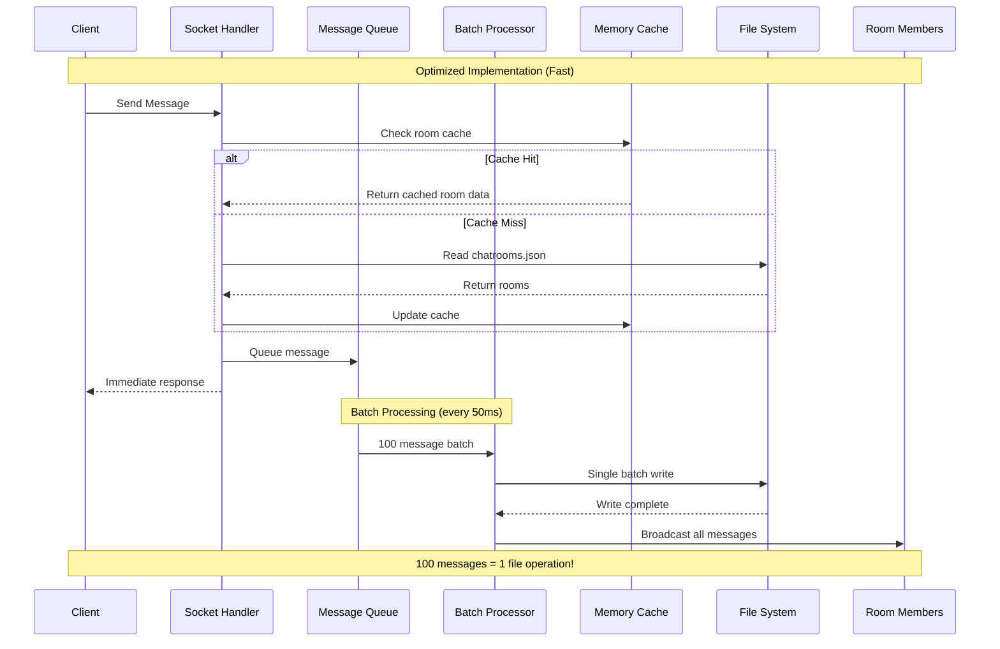

# 🚀 Final Performance Challenge: Complete Solution Guide

## 📋 Problem Situation Analysis

### 🔍 Current Performance Issues

1. **Execute Large Message Load Test**
   ```bash
   kubectl exec -it minitalk-loadtest-7fdc87d54-45sqp -n jonny -- python new_year_load_test.py
   ```

2. **Identified Problems**
   - Message transmission delays and failures
   - High CPU usage
   - Memory usage spikes
   - File I/O bottlenecks

### 🔍 Code Analysis Results

**Current problematic code location**: `backend/ws/socketHandler.js`

```javascript
// Current inefficient processing method
socket.on('send_message', async (data) => {
  // Process each message individually
  const messageData = { roomId, sender, content, timestamp: new Date().toISOString() };
  const savedMessage = await dataManager.createMessage(messageData);
  
  // Broadcast immediately after individual save
  io.to(roomId).emit('message', { /* ... */ });
});
```

**Problems:**
- Save messages one by one to file (file I/O bottleneck)
- File lock contention when handling large requests
- Message transmission delays or failures
- No caching system

## 📊 Data Flow Comparison

### Before: Individual Processing Method



**Problems:**
- File I/O occurs for each message (red)
- File lock contention with concurrent requests
- Increased processing time

### After: Batch Processing Method



**Improvements:**
- Multiple messages processed together in single file I/O (green)
- Resolved file lock contention
- Reduced processing time

## 🚀 Solution: 3-Step Optimization

### 🎯 Core Ideas
1. **Batch Processing**: Collect multiple messages and process them together
2. **Caching System**: Reduce file I/O with memory cache
3. **Asynchronous Processing**: Immediate response, background processing

## 🔧 Implementation Steps

### Step 1: MessageProcessor Class Implementation

Add the following class to `backend/ws/socketHandler.js`:

```javascript
class MessageProcessor {
  constructor() {
    this.messageQueue = [];
    this.processing = false;
    this.batchSize = 100; // Process 100 messages at a time
    this.flushInterval = 50; // Process every 50ms
    this.stats = {
      processed: 0,
      queued: 0,
      startTime: Date.now()
    };
    
    this.startBatchProcessor();
  }
  
  // Add message to queue
  queueMessage(messageData) {
    this.messageQueue.push(messageData);
    this.stats.queued++;
    
    // Process immediately if queue is full
    if (this.messageQueue.length >= this.batchSize) {
      this.flushMessages();
    }
  }
  
  // Periodically process batches
  startBatchProcessor() {
    setInterval(() => {
      if (this.messageQueue.length > 0) {
        this.flushMessages();
      }
    }, this.flushInterval);
    
    // Performance monitoring
    setInterval(() => {
      if (this.stats.processed > 0 || this.messageQueue.length > 0) {
        const runtime = (Date.now() - this.stats.startTime) / 1000;
        const avgRate = this.stats.processed / runtime;
        
        console.log(`📊 Message Processing Stats:` +
          ` Processed: ${this.stats.processed.toLocaleString()}` +
          ` | Queue: ${this.messageQueue.length}` +
          ` | Rate: ${avgRate.toFixed(0)}/sec` +
          ` | Total: ${this.stats.queued.toLocaleString()}`);
      }
    }, 1000);
  }
  
  // Process messages in batch
  async flushMessages() {
    if (this.processing || this.messageQueue.length === 0) return;
    
    this.processing = true;
    const batch = this.messageQueue.splice(0, this.batchSize);
    
    try {
      // Save batch to database
      const savedMessages = await dataManager.createMessagesBatch(batch.map(msgData => ({
        roomId: msgData.roomId,
        sender: msgData.sender,
        content: msgData.content,
        timestamp: msgData.timestamp
      })));
      
      // Batch broadcast
      batch.forEach((msgData, index) => {
        const savedMessage = savedMessages[index];
        
        msgData.io.to(msgData.roomId).emit('message', {
          type: 'message',
          roomId: msgData.roomId,
          sender: msgData.sender,
          content: msgData.content,
          timestamp: savedMessage.timestamp
        });
        
        this.stats.processed++;
      });
      
    } catch (error) {
      console.error('Batch processing error:', error);
    } finally {
      this.processing = false;
    }
  }
}

// Global message processor instance
const messageProcessor = new MessageProcessor();
```

### Step 2: Socket Handler Modification

Modify the socket event handler in `backend/ws/socketHandler.js`:

```javascript
socket.on('send_message', async (data) => {
  try {
    const { roomId, content } = data;
    const sender = socket.userId;

    if (!roomId || !content) {
      socket.emit('error', { message: 'roomId and content are required' });
      return;
    }

    // Quick validation (using cache)
    const chatRoom = await dataManager.findChatRoomByRoomId(roomId);
    if (!chatRoom || !chatRoom.participants.includes(sender)) {
      socket.emit('error', { message: 'You are not a member of this chat room' });
      return;
    }

    // Add to queue for batch processing
    messageProcessor.queueMessage({
      roomId,
      sender,
      content,
      timestamp: new Date().toISOString(),
      io: io // Pass io for broadcasting
    });

    // Immediate response (actual processing in background)

  } catch (error) {
    console.error('Send message error:', error);
    socket.emit('error', { message: 'Failed to send message' });
  }
});
```

### Step 3: Add Caching System to DataManager

Add caching functionality to `backend/data/dataManager.js`:

```javascript
class FileDataManager {
  constructor() {
    // ... existing properties ...
    
    // Memory cache to reduce file I/O
    this.cache = new Map();
    this.cacheTimeout = 3000; // 3 second cache timeout
    this.lastCacheUpdate = new Map();
    
    // File read throttling
    this.activeReads = new Map();
    this.maxConcurrentReads = 5;
    
    this.initializeStorage();
  }
  
  // Cached file reading
  async readFile(filePath) {
    // Check cache first
    const cacheKey = filePath;
    const lastUpdate = this.lastCacheUpdate.get(cacheKey);
    const now = Date.now();
    
    if (lastUpdate && (now - lastUpdate) < this.cacheTimeout && this.cache.has(cacheKey)) {
      return this.cache.get(cacheKey);
    }
    
    // Limit concurrent reads
    const activeCount = this.activeReads.get(filePath) || 0;
    if (activeCount >= this.maxConcurrentReads) {
      // Use cached data
      if (this.cache.has(cacheKey)) {
        return this.cache.get(cacheKey);
      }
      // Wait briefly and retry
      await new Promise(resolve => setTimeout(resolve, 100));
    }
    
    try {
      // Track active reads
      this.activeReads.set(filePath, activeCount + 1);
      
      const data = await fs.readFile(filePath, 'utf8');
      const parsedData = JSON.parse(data);
      
      // Update cache
      this.cache.set(cacheKey, parsedData);
      this.lastCacheUpdate.set(cacheKey, now);
      
      return parsedData;
    } catch (error) {
      console.error(`Error reading file ${filePath}:`, error);
      
      // Use cached data if available
      if (this.cache.has(cacheKey)) {
        console.log(`Using cached data for ${filePath} due to read error`);
        return this.cache.get(cacheKey);
      }
      
      return [];
    } finally {
      // Decrease active read count
      const currentCount = this.activeReads.get(filePath) || 1;
      this.activeReads.set(filePath, Math.max(0, currentCount - 1));
    }
  }
  
  // Atomic write with cache update
  async writeFile(filePath, data) {
    try {
      // Atomic write with temporary file (prevents corruption)
      const tempFile = `${filePath}.tmp.${Date.now()}.${Math.random().toString(36).substr(2, 9)}`;
      await fs.writeFile(tempFile, JSON.stringify(data, null, 2));
      await fs.rename(tempFile, filePath);
      
      // Update cache
      const cacheKey = filePath;
      this.cache.set(cacheKey, data);
      this.lastCacheUpdate.set(cacheKey, Date.now());
      
    } catch (error) {
      console.error(`Error writing file ${filePath}:`, error);
      throw error;
    }
  }
}
```

### Step 4: Add Batch Message Creation Method

Add batch processing method to `backend/data/dataManager.js`:

```javascript
async createMessagesBatch(messagesData) {
  return this.queueFileOperation(this.messagesFile, async () => {
    const messages = await this.readFile(this.messagesFile);
    
    const newMessages = messagesData.map(messageData => ({
      id: Date.now().toString() + Math.random().toString(36).substr(2, 9),
      roomId: messageData.roomId,
      sender: messageData.sender,
      content: messageData.content,
      timestamp: messageData.timestamp || new Date().toISOString(),
      createdAt: new Date().toISOString()
    }));
    
    messages.push(...newMessages);
    await this.writeFile(this.messagesFile, messages);
    
    return newMessages;
  });
}
```

## 📊 Performance Comparison Analysis

### Before vs After Sequence Diagram

#### Before: Individual Processing (Slow)


#### After: Batch Processing (Fast)


## ✅ Verification Steps

### Step 1: Re-run Large Message Load Test
```bash
kubectl exec -it minitalk-loadtest-7fdc87d54-45sqp -n jonny -- python new_year_load_test.py
```

### Step 2: Verify Improvement Effect in Frontend
1. Access MinitalkChat in browser
2. Try sending messages in chat room
3. **Verify Improvement**: Check if messages are sent normally

---

**Implement and verify step by step for successful performance optimization! 🚀**
