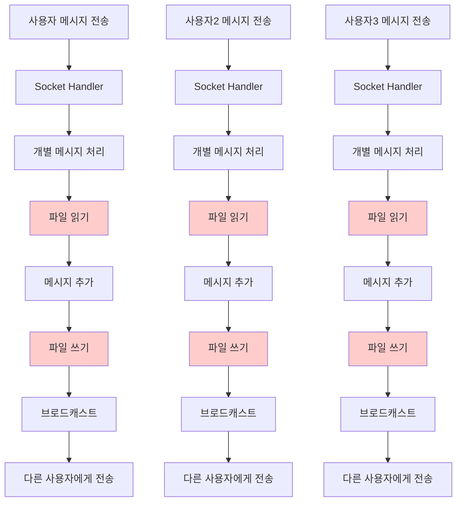
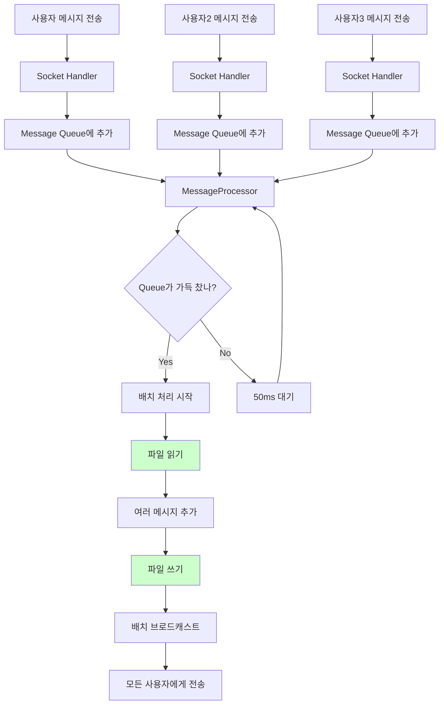
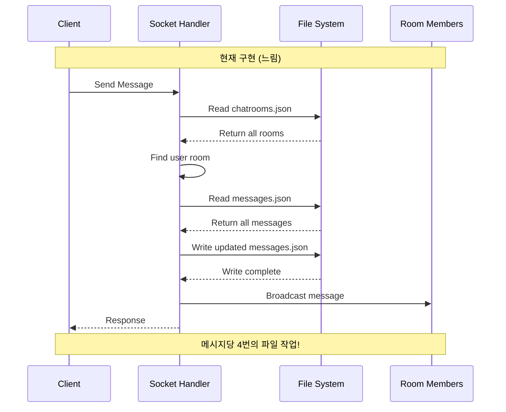
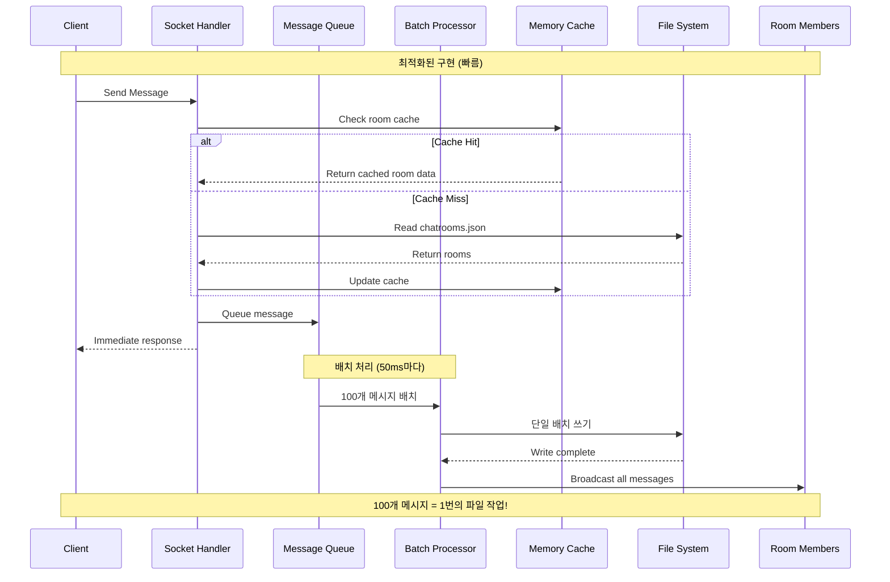

# 🚀 Final Performance Challenge: Complete Solution Guide

## 📋 문제 상황 분석

### 🔍 현재 성능 이슈

1. **대량 메시지 부하 테스트 실행**
   ```bash
   kubectl exec -it minitalk-loadtest-7fdc87d54-45sqp -n jonny -- python new_year_load_test.py
   ```

2. **발견된 문제점**
   - 메시지 전송 지연 및 실패
   - 높은 CPU 사용률
   - 메모리 사용량 급증
   - 파일 I/O 병목 현상

### 🔍 코드 분석 결과

**현재 문제가 있는 코드 위치**: `backend/ws/socketHandler.js`

```javascript
// 현재 비효율적인 처리 방식
socket.on('send_message', async (data) => {
  // 각 메시지마다 개별적으로 처리
  const messageData = { roomId, sender, content, timestamp: new Date().toISOString() };
  const savedMessage = await dataManager.createMessage(messageData);
  
  // 개별 저장 후 즉시 브로드캐스트
  io.to(roomId).emit('message', { /* ... */ });
});
```

**문제점:**
- 메시지 하나씩 파일에 저장 (파일 I/O 병목)
- 대량 요청 시 파일 락 경합 발생
- 메시지 전송이 지연되거나 실패
- 캐싱 시스템 부재

## 📊 데이터 흐름 비교

### Before: 개별 처리 방식



**문제점:**
- 각 메시지마다 파일 I/O 발생 (빨간색)
- 동시 요청 시 파일 락 경합
- 처리 시간 증가

### After: 배치 처리 방식



**개선점:**
- 여러 메시지를 모아서 한 번에 파일 I/O (초록색)
- 파일 락 경합 해결
- 처리 시간 단축

## 🚀 해결 방안: 3단계 최적화

### 🎯 핵심 아이디어
1. **배치 처리**: 여러 메시지를 모아서 한 번에 처리
2. **캐싱 시스템**: 메모리 캐시로 파일 I/O 감소
3. **비동기 처리**: 즉시 응답, 백그라운드 처리

## 🔧 구현 단계

### Step 1: MessageProcessor 클래스 구현

`backend/ws/socketHandler.js`에 다음 클래스를 추가:

```javascript
class MessageProcessor {
  constructor() {
    this.messageQueue = [];
    this.processing = false;
    this.batchSize = 100; // 100개씩 배치 처리
    this.flushInterval = 50; // 50ms마다 처리
    this.stats = {
      processed: 0,
      queued: 0,
      startTime: Date.now()
    };
    
    this.startBatchProcessor();
  }
  
  // 메시지를 큐에 추가
  queueMessage(messageData) {
    this.messageQueue.push(messageData);
    this.stats.queued++;
    
    // 큐가 가득 차면 즉시 처리
    if (this.messageQueue.length >= this.batchSize) {
      this.flushMessages();
    }
  }
  
  // 주기적으로 배치 처리
  startBatchProcessor() {
    setInterval(() => {
      if (this.messageQueue.length > 0) {
        this.flushMessages();
      }
    }, this.flushInterval);
    
    // 성능 모니터링
    setInterval(() => {
      if (this.stats.processed > 0 || this.messageQueue.length > 0) {
        const runtime = (Date.now() - this.stats.startTime) / 1000;
        const avgRate = this.stats.processed / runtime;
        
        console.log(`📊 Message Processing Stats:` +
          ` Processed: ${this.stats.processed.toLocaleString()}` +
          ` | Queue: ${this.messageQueue.length}` +
          ` | Rate: ${avgRate.toFixed(0)}/sec` +
          ` | Total: ${this.stats.queued.toLocaleString()}`);
      }
    }, 1000);
  }
  
  // 배치로 메시지 처리
  async flushMessages() {
    if (this.processing || this.messageQueue.length === 0) return;
    
    this.processing = true;
    const batch = this.messageQueue.splice(0, this.batchSize);
    
    try {
      // 배치로 데이터베이스에 저장
      const savedMessages = await dataManager.createMessagesBatch(batch.map(msgData => ({
        roomId: msgData.roomId,
        sender: msgData.sender,
        content: msgData.content,
        timestamp: msgData.timestamp
      })));
      
      // 배치로 브로드캐스트
      batch.forEach((msgData, index) => {
        const savedMessage = savedMessages[index];
        
        msgData.io.to(msgData.roomId).emit('message', {
          type: 'message',
          roomId: msgData.roomId,
          sender: msgData.sender,
          content: msgData.content,
          timestamp: savedMessage.timestamp
        });
        
        this.stats.processed++;
      });
      
    } catch (error) {
      console.error('Batch processing error:', error);
    } finally {
      this.processing = false;
    }
  }
}

// 전역 메시지 프로세서 인스턴스
const messageProcessor = new MessageProcessor();
```

### Step 2: 소켓 핸들러 수정

`backend/ws/socketHandler.js`의 소켓 이벤트 핸들러를 수정:

```javascript
socket.on('send_message', async (data) => {
  try {
    const { roomId, content } = data;
    const sender = socket.userId;

    if (!roomId || !content) {
      socket.emit('error', { message: 'roomId and content are required' });
      return;
    }

    // 빠른 검증 (캐시 활용)
    const chatRoom = await dataManager.findChatRoomByRoomId(roomId);
    if (!chatRoom || !chatRoom.participants.includes(sender)) {
      socket.emit('error', { message: 'You are not a member of this chat room' });
      return;
    }

    // 배치 처리를 위해 큐에 추가
    messageProcessor.queueMessage({
      roomId,
      sender,
      content,
      timestamp: new Date().toISOString(),
      io: io // 브로드캐스트용 io 전달
    });

    // 즉시 응답 (실제 처리는 백그라운드에서)

  } catch (error) {
    console.error('Send message error:', error);
    socket.emit('error', { message: 'Failed to send message' });
  }
});
```

### Step 3: DataManager에 캐싱 시스템 추가

`backend/data/dataManager.js`에 캐싱 기능 추가:

```javascript
class FileDataManager {
  constructor() {
    // ... 기존 속성들 ...
    
    // 메모리 캐시로 파일 I/O 감소
    this.cache = new Map();
    this.cacheTimeout = 3000; // 3초 캐시 타임아웃
    this.lastCacheUpdate = new Map();
    
    // 파일 읽기 스로틀링
    this.activeReads = new Map();
    this.maxConcurrentReads = 5;
    
    this.initializeStorage();
  }
  
  // 캐시된 파일 읽기
  async readFile(filePath) {
    // 캐시 먼저 확인
    const cacheKey = filePath;
    const lastUpdate = this.lastCacheUpdate.get(cacheKey);
    const now = Date.now();
    
    if (lastUpdate && (now - lastUpdate) < this.cacheTimeout && this.cache.has(cacheKey)) {
      return this.cache.get(cacheKey);
    }
    
    // 동시 읽기 제한
    const activeCount = this.activeReads.get(filePath) || 0;
    if (activeCount >= this.maxConcurrentReads) {
      // 캐시된 데이터 사용
      if (this.cache.has(cacheKey)) {
        return this.cache.get(cacheKey);
      }
      // 잠시 대기 후 재시도
      await new Promise(resolve => setTimeout(resolve, 100));
    }
    
    try {
      // 활성 읽기 추적
      this.activeReads.set(filePath, activeCount + 1);
      
      const data = await fs.readFile(filePath, 'utf8');
      const parsedData = JSON.parse(data);
      
      // 캐시 업데이트
      this.cache.set(cacheKey, parsedData);
      this.lastCacheUpdate.set(cacheKey, now);
      
      return parsedData;
    } catch (error) {
      console.error(`Error reading file ${filePath}:`, error);
      
      // 캐시된 데이터가 있으면 사용
      if (this.cache.has(cacheKey)) {
        console.log(`Using cached data for ${filePath} due to read error`);
        return this.cache.get(cacheKey);
      }
      
      return [];
    } finally {
      // 활성 읽기 수 감소
      const currentCount = this.activeReads.get(filePath) || 1;
      this.activeReads.set(filePath, Math.max(0, currentCount - 1));
    }
  }
  
  // 원자적 쓰기와 캐시 업데이트
  async writeFile(filePath, data) {
    try {
      // 임시 파일로 원자적 쓰기 (손상 방지)
      const tempFile = `${filePath}.tmp.${Date.now()}.${Math.random().toString(36).substr(2, 9)}`;
      await fs.writeFile(tempFile, JSON.stringify(data, null, 2));
      await fs.rename(tempFile, filePath);
      
      // 캐시 업데이트
      const cacheKey = filePath;
      this.cache.set(cacheKey, data);
      this.lastCacheUpdate.set(cacheKey, Date.now());
      
    } catch (error) {
      console.error(`Error writing file ${filePath}:`, error);
      throw error;
    }
  }
}
```

### Step 4: 배치 메시지 생성 메서드 추가

`backend/data/dataManager.js`에 배치 처리 메서드 추가:

```javascript
async createMessagesBatch(messagesData) {
  return this.queueFileOperation(this.messagesFile, async () => {
    const messages = await this.readFile(this.messagesFile);
    
    const newMessages = messagesData.map(messageData => ({
      id: Date.now().toString() + Math.random().toString(36).substr(2, 9),
      roomId: messageData.roomId,
      sender: messageData.sender,
      content: messageData.content,
      timestamp: messageData.timestamp || new Date().toISOString(),
      createdAt: new Date().toISOString()
    }));
    
    messages.push(...newMessages);
    await this.writeFile(this.messagesFile, messages);
    
    return newMessages;
  });
}
```

## 📊 성능 비교 분석

### Before vs After 시퀀스 다이어그램

#### Before: 개별 처리 (느림)


#### After: 배치 처리 (빠름)


## ✅ 검증 단계

### Step 1: 대량 메시지 부하 테스트 재실행
```bash
kubectl exec -it minitalk-loadtest-7fdc87d54-45sqp -n jonny -- python new_year_load_test.py
```

### Step 2: 프론트엔드에서 개선 효과 확인
1. 브라우저에서 MinitalkChat 접속
2. 채팅방에서 메시지 전송 시도
3. **개선 확인**: 메시지가 정상적으로 전송되는지 확인

---

**성공적인 성능 최적화를 위해 단계별로 구현하고 검증하세요! 🚀**
