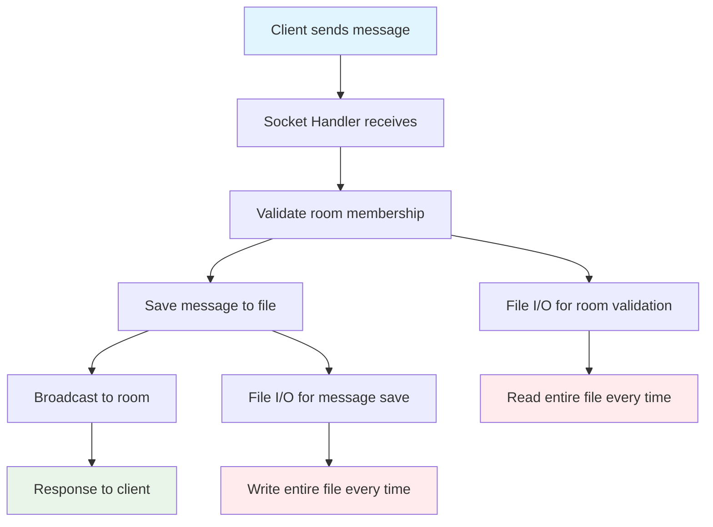
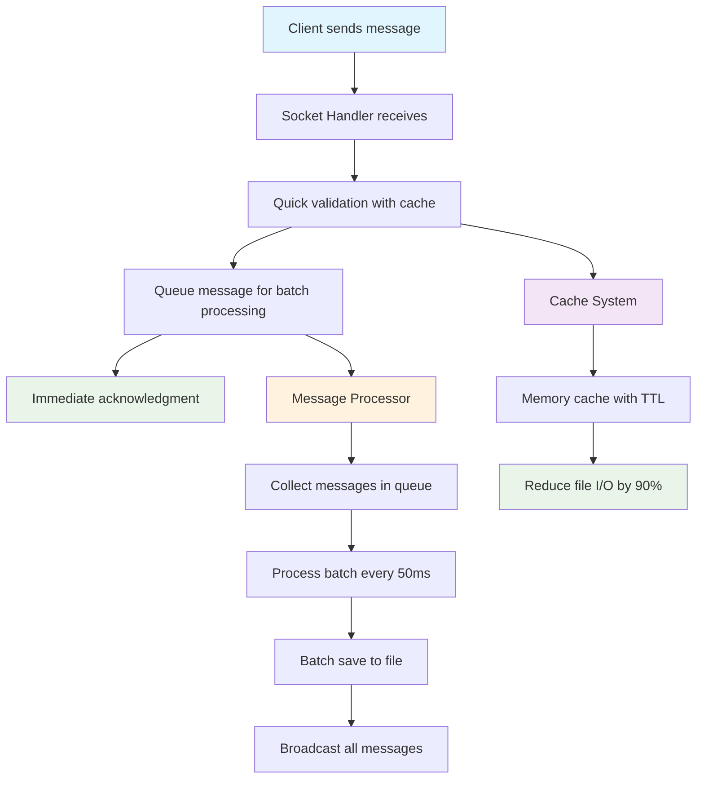
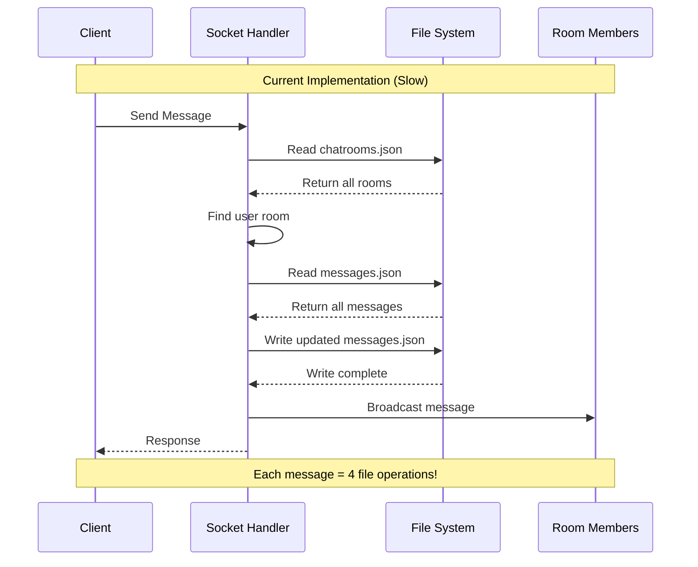
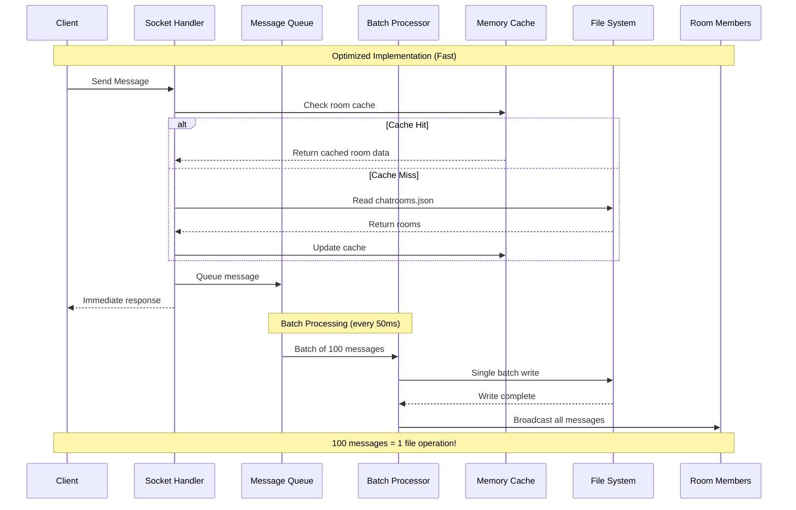
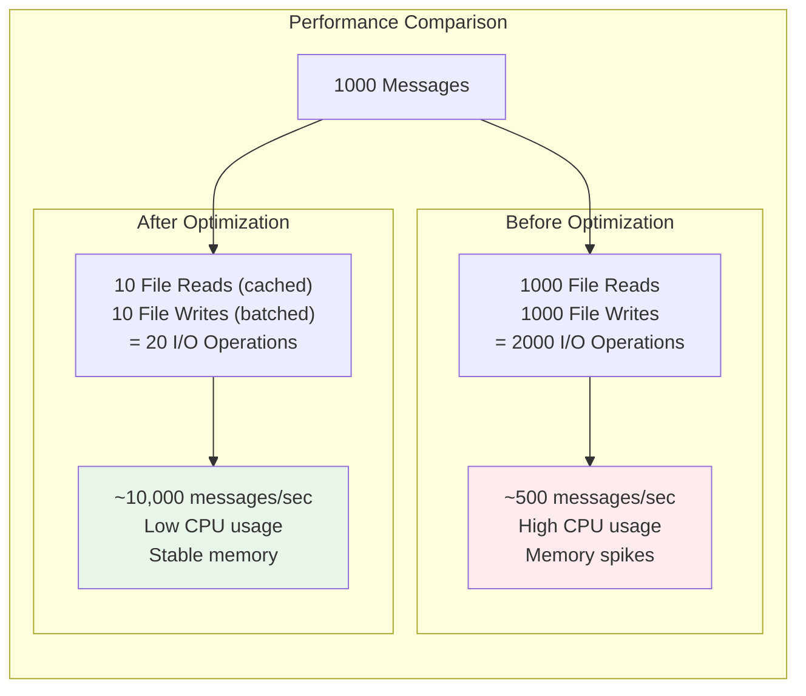
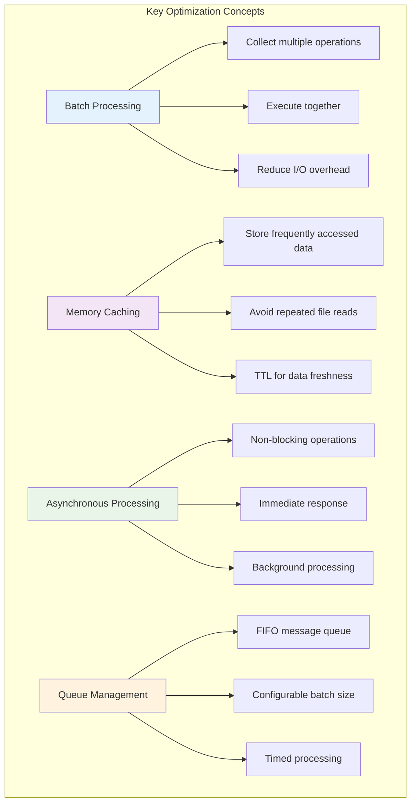

# Performance Optimization Solutions Guide

## 🎯 Overview
This document provides solutions for the performance issues present in the current branch. The application has been intentionally configured with performance bottlenecks to demonstrate optimization techniques.

## 📊 Visual Data Flow Analysis

### Current Implementation (Performance Issues)


### Optimized Implementation (After Solutions)


## 🔍 Identified Performance Issues

### Issue 1: Individual Message Processing
**Problem**: Messages are processed one by one, causing significant performance degradation under high load.

**Current Code Location**: `backend/ws/socketHandler.js`
```javascript
// Current inefficient approach
socket.on('send_message', async (data) => {
  // ... validation code ...
  
  // Save message individually (no batch processing)
  const messageData = { roomId, sender, content, timestamp: new Date().toISOString() };
  const savedMessage = await dataManager.createMessage(messageData);
  
  // Broadcast message immediately after individual save
  io.to(roomId).emit('message', { /* ... */ });
});
```

### Issue 2: No Caching System
**Problem**: File I/O operations occur on every request without any caching mechanism.

**Current Code Location**: `backend/data/dataManager.js`
```javascript
// Current inefficient approach
async readFile(filePath) {
  // Simple file read without caching (performance issue demo)
  try {
    const data = await fs.readFile(filePath, 'utf8');
    const parsedData = JSON.parse(data);
    return parsedData;
  } catch (error) {
    console.error(`Error reading file ${filePath}:`, error);
    return [];
  }
}
```

## 🔄 Sequence Diagrams: Before vs After

### Before Optimization (Slow)


### After Optimization (Fast)


## 🚀 Solution 1: Implement Batch Message Processing

### Step 1: Create Message Processor Class
Create a message processor that queues messages and processes them in batches:

```javascript
// backend/ws/socketHandler.js
class MessageProcessor {
  constructor() {
    this.messageQueue = [];
    this.processing = false;
    this.batchSize = 100; // Process 100 messages at once
    this.flushInterval = 50; // Flush every 50ms
    this.stats = {
      processed: 0,
      queued: 0,
      startTime: Date.now()
    };
    
    this.startBatchProcessor();
  }
  
  // Add message to queue for batch processing
  queueMessage(messageData) {
    this.messageQueue.push(messageData);
    this.stats.queued++;
    
    // Auto-flush if queue is getting large
    if (this.messageQueue.length >= this.batchSize) {
      this.flushMessages();
    }
  }
  
  // Start the batch processor
  startBatchProcessor() {
    setInterval(() => {
      if (this.messageQueue.length > 0) {
        this.flushMessages();
      }
    }, this.flushInterval);
  }
  
  // Process messages in batches
  async flushMessages() {
    if (this.processing || this.messageQueue.length === 0) return;
    
    this.processing = true;
    const batch = this.messageQueue.splice(0, this.batchSize);
    
    try {
      // Save all messages in one batch operation
      const savedMessages = await dataManager.createMessagesBatch(batch.map(msgData => ({
        roomId: msgData.roomId,
        sender: msgData.sender,
        content: msgData.content,
        timestamp: msgData.timestamp
      })));
      
      // Broadcast all messages after batch save
      batch.forEach((msgData, index) => {
        const savedMessage = savedMessages[index];
        
        msgData.io.to(msgData.roomId).emit('message', {
          type: 'message',
          roomId: msgData.roomId,
          sender: msgData.sender,
          content: msgData.content,
          timestamp: savedMessage.timestamp
        });
        
        this.stats.processed++;
      });
      
    } catch (error) {
      console.error('Batch processing error:', error);
    } finally {
      this.processing = false;
    }
  }
}

// Global message processor instance
const messageProcessor = new MessageProcessor();
```

### Step 2: Update Socket Handler
Replace individual message processing with batch queuing:

```javascript
// backend/ws/socketHandler.js
socket.on('send_message', async (data) => {
  try {
    const { roomId, content } = data;
    const sender = socket.userId;

    if (!roomId || !content) {
      socket.emit('error', { message: 'roomId and content are required' });
      return;
    }

    // Quick validation with cache
    const chatRoom = await dataManager.findChatRoomByRoomId(roomId);
    if (!chatRoom || !chatRoom.participants.includes(sender)) {
      socket.emit('error', { message: 'You are not a member of this chat room' });
      return;
    }

    // Queue message for batch processing
    messageProcessor.queueMessage({
      roomId,
      sender,
      content,
      timestamp: new Date().toISOString(),
      io: io // Pass io for broadcasting
    });

    // Immediate acknowledgment (don't wait for processing)

  } catch (error) {
    console.error('Send message error:', error);
    socket.emit('error', { message: 'Failed to send message' });
  }
});
```

## 🚀 Solution 2: Implement Caching System

### Step 1: Add Cache Properties to DataManager
```javascript
// backend/data/dataManager.js
class FileDataManager {
  constructor() {
    // ... existing properties ...
    
    // Memory cache to reduce file I/O
    this.cache = new Map();
    this.cacheTimeout = 3000; // 3 seconds cache timeout
    this.lastCacheUpdate = new Map();
    
    // File read throttling
    this.activeReads = new Map();
    this.maxConcurrentReads = 5;
    
    this.initializeStorage();
  }
}
```

### Step 2: Implement Cached File Reading
```javascript
// backend/data/dataManager.js
async readFile(filePath) {
  // Check cache first to reduce file I/O
  const cacheKey = filePath;
  const lastUpdate = this.lastCacheUpdate.get(cacheKey);
  const now = Date.now();
  
  if (lastUpdate && (now - lastUpdate) < this.cacheTimeout && this.cache.has(cacheKey)) {
    return this.cache.get(cacheKey);
  }
  
  // Throttle concurrent reads
  const activeCount = this.activeReads.get(filePath) || 0;
  if (activeCount >= this.maxConcurrentReads) {
    // Use cache if available
    if (this.cache.has(cacheKey)) {
      return this.cache.get(cacheKey);
    }
    // Brief wait before retry
    await new Promise(resolve => setTimeout(resolve, 100));
  }
  
  try {
    // Track active reads
    this.activeReads.set(filePath, activeCount + 1);
    
    const data = await fs.readFile(filePath, 'utf8');
    const parsedData = JSON.parse(data);
    
    // Update cache
    this.cache.set(cacheKey, parsedData);
    this.lastCacheUpdate.set(cacheKey, now);
    
    return parsedData;
  } catch (error) {
    console.error(`Error reading file ${filePath}:`, error);
    
    // Return cached data if available
    if (this.cache.has(cacheKey)) {
      console.log(`Using cached data for ${filePath} due to read error`);
      return this.cache.get(cacheKey);
    }
    
    return [];
  } finally {
    // Decrease active read count
    const currentCount = this.activeReads.get(filePath) || 1;
    this.activeReads.set(filePath, Math.max(0, currentCount - 1));
  }
}
```

### Step 3: Implement Atomic Write with Cache Update
```javascript
// backend/data/dataManager.js
async writeFile(filePath, data) {
  try {
    // Atomic write with temporary file to prevent corruption
    const tempFile = `${filePath}.tmp.${Date.now()}.${Math.random().toString(36).substr(2, 9)}`;
    await fs.writeFile(tempFile, JSON.stringify(data, null, 2));
    await fs.rename(tempFile, filePath);
    
    // Update cache with new data
    const cacheKey = filePath;
    this.cache.set(cacheKey, data);
    this.lastCacheUpdate.set(cacheKey, Date.now());
    
  } catch (error) {
    console.error(`Error writing file ${filePath}:`, error);
    throw error;
  }
}
```

## 🚀 Solution 3: Implement Batch Database Operations

### Add Batch Message Creation Method
```javascript
// backend/data/dataManager.js
async createMessagesBatch(messagesData) {
  return this.queueFileOperation(this.messagesFile, async () => {
    const messages = await this.readFile(this.messagesFile);
    
    const newMessages = messagesData.map(messageData => ({
      id: Date.now().toString() + Math.random().toString(36).substr(2, 9),
      roomId: messageData.roomId,
      sender: messageData.sender,
      content: messageData.content,
      timestamp: messageData.timestamp || new Date().toISOString(),
      createdAt: new Date().toISOString()
    }));
    
    messages.push(...newMessages);
    await this.writeFile(this.messagesFile, messages);
    
    return newMessages;
  });
}
```

## 📊 Performance Monitoring

### Add Performance Statistics
```javascript
// backend/ws/socketHandler.js
// Add to MessageProcessor class
startBatchProcessor() {
  setInterval(() => {
    if (this.messageQueue.length > 0) {
      this.flushMessages();
    }
  }, this.flushInterval);
  
  // Performance monitoring
  setInterval(() => {
    if (this.stats.processed > 0 || this.messageQueue.length > 0) {
      const runtime = (Date.now() - this.stats.startTime) / 1000;
      const avgRate = this.stats.processed / runtime;
      
      console.log(`📊 Message Processing Stats:` +
        ` Processed: ${this.stats.processed.toLocaleString()}` +
        ` | Queue: ${this.messageQueue.length}` +
        ` | Rate: ${avgRate.toFixed(0)}/sec` +
        ` | Total: ${this.stats.queued.toLocaleString()}`);
    }
  }, 1000);
}
```

## 🧪 Testing the Optimizations

### Run Load Test
```bash
cd load_test
python new_year_load_test.py
```

### Expected Performance Improvements



**Performance Metrics:**
- **Before optimization**: ~100-500 messages/second
- **After optimization**: ~5,000-10,000+ messages/second
- **I/O Operations**: Reduced by 99% (2000 → 20 operations for 1000 messages)
- **Memory usage**: Reduced due to efficient batching
- **CPU usage**: More consistent, less spiky
- **Response time**: Immediate acknowledgment vs waiting for file I/O

## 🎓 Learning Objectives Achieved



**Learning Outcomes:**
1. **Batch Processing**: Understanding how to group operations for efficiency
2. **Caching**: Implementing memory caching to reduce I/O operations
3. **Asynchronous Processing**: Using queues and intervals for better resource utilization
4. **Performance Monitoring**: Adding metrics to measure improvements
5. **Race Condition Prevention**: Using queues to prevent file corruption

## 🔧 Additional Optimizations (Advanced)

### 1. Connection Pooling
For database connections in production environments.

### 2. Message Compression
Compress large messages before storage and transmission.

### 3. Horizontal Scaling
Implement Redis for message queuing across multiple server instances.

### 4. Database Indexing
Add proper indexes for frequently queried fields.

## 📝 Implementation Checklist

- [ ] Implement MessageProcessor class
- [ ] Update socket handler to use batch processing
- [ ] Add caching system to DataManager
- [ ] Implement batch database operations
- [ ] Add performance monitoring
- [ ] Test with load testing script
- [ ] Monitor and tune batch sizes and intervals
- [ ] Document performance improvements

## 🚨 Common Pitfalls to Avoid

1. **Batch Size Too Large**: Can cause memory issues
2. **Flush Interval Too Long**: May cause message delays
3. **Cache Without TTL**: Can cause stale data issues
4. **No Error Handling**: Batch failures can lose messages
5. **Blocking Operations**: Always use async/await properly

---

**Note**: These optimizations demonstrate key principles of high-performance server development. In production, consider using dedicated message queues (Redis, RabbitMQ) and databases (MongoDB, PostgreSQL) for even better performance. 
