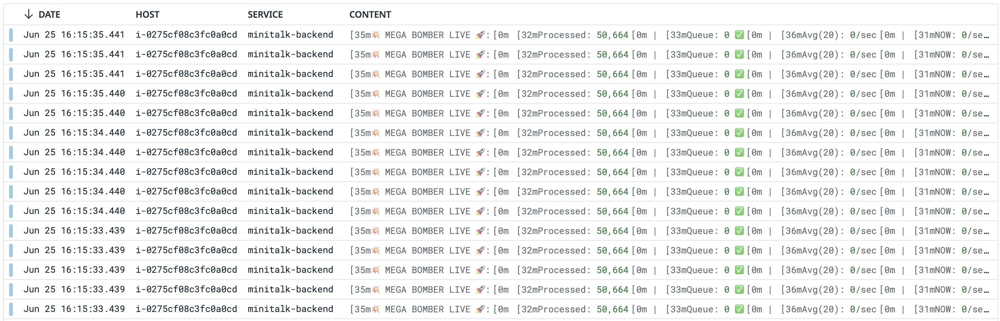

# 監視

この研修では、Datadogの監視機能を使用して監視を設定してみましょう。  
slackの専用チャンネル(#15th_dev_notification)に通知を送ることができるようになっています。

## 回答

DataDogでログを正常に確認することができました

上記の画像のように、DataDogのログダッシュボードでアプリケーションのログをリアルタイムで監視することができ、ログレベル別にフィルタリングし、検索機能を通じて特定のログを見つけることができました 
