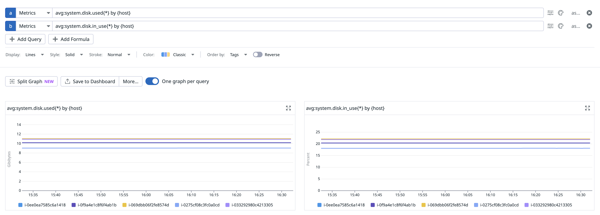
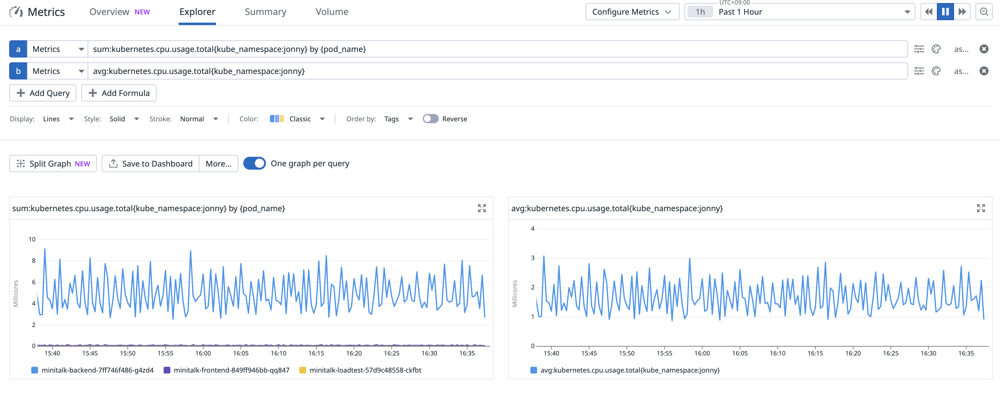
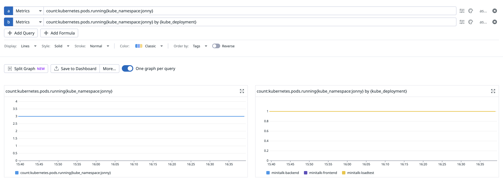
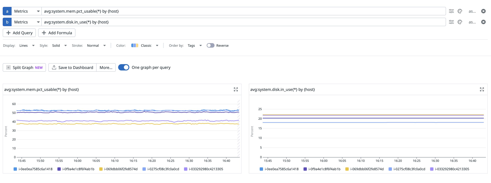

# メトリック

## 1.1. メトリックを見てみよう

各ノードにはDatadog Agentがインストールされており、メトリック収集設定が有効になっています。
次の質問に答えてみましょう

- あなたがデプロイしたPodの各コンテナに割り当てられたメモリは十分ですか？
- あなたのk8sクラスターを構成するノードのストレージは時間が経過しても不足しませんか？
- あなたがデプロイしたPodはそのノードのCPU時間をどの程度の割合で使用していますか？
- あなたがデプロイしたPodの数はどのように推移していますか？
- あなたのk8sクラスターを構成するノードはどのように推移していますか？

## 回答

### 1. あなたがデプロイしたPodの各コンテナに割り当てられたメモリは十分ですか？

**現在の状況:**
- **Backend**: 412Mi 使用 / 1Gi 要求 / 2Gi 制限 → **十分** (52% 使用)
- **Frontend**: 5Mi 使用 / 512Mi 要求 / 1Gi 制限 → **非常に十分** (1% 使用)
- **Loadtest**: 207Mi 使用 / 1Gi 要求 / 2Gi 制限 → **十分** (24% 使用)

### 2. あなたのk8sクラスターを構成するノードのストレージは時間が経過しても不足しませんか？

**現在の状況:**
- **全ノード**: それぞれ ~50GB ストレージ容量
- **使用可能**: それぞれ ~44GB 
- **現在の使用率**: 約 12%

**ストレージは十分です**

**Datadogクエリ:**

### 3. あなたがデプロイしたPodはそのノードのCPU時間をどの程度の割合で使用していますか？

**現在の状況:**
- **minitalk 総CPU使用量**: 6m (Backend 5m + Frontend 1m + Loadtest 0m)
- **全クラスターCPU使用量**: 451m
- **minitalk CPU占有率**: 約 **1.3%**

**Datadogクエリ:**

### 4. あなたがデプロイしたPodの数はどのように推移していますか？

**現在の状況:**
- **合計3個のPod** (Backend 1個、Frontend 1個、Loadtest 1個)
- **すべてのPodがRunning状態**
- **再起動回数**: 0回 (安定)

**Datadogクエリ:**

### 5. あなたのk8sクラスターを構成するノードはどのように推移していますか？

**現在の状況:**
- **合計5個のノード** すべてReady状態
- **ノードリソース使用率**:
  - CPU: 4-5% (非常に低い)
  - メモリ: 48-68% (普通)

**Datadogクエリ:**
 
