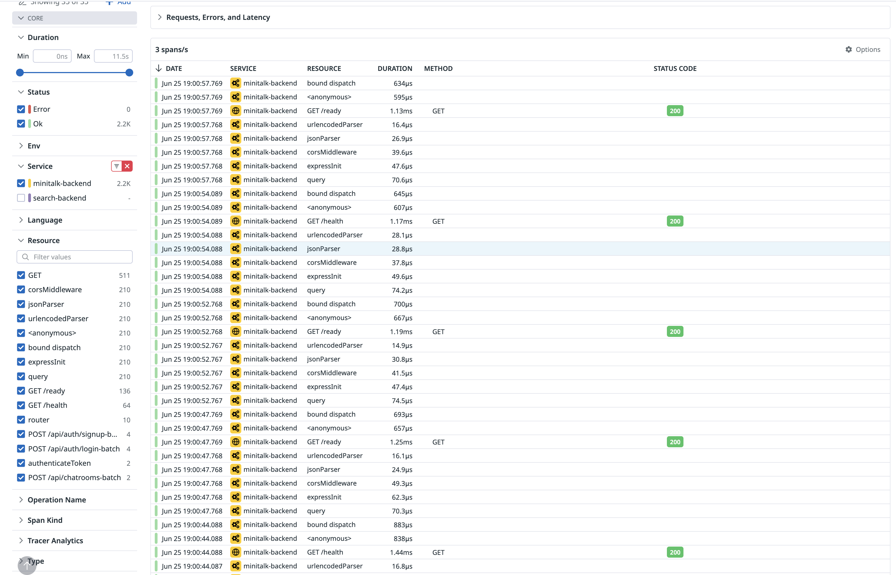

# トレース

## 3.1. トレースを出力してみよう

OTel エコシステムのSDKを使用してトレースを出力してみましょう。

https://opentelemetry.io/docs/languages/ruby/

各言語に対応したSDKが提供されています。チュートリアルも提供されているため、これに従って進めるのが良いでしょう。

## 回答

### 3.1. トレース出力 ✅
OpenTelemetry Node.js SDKを使用して`minitalk-backend`サービスにトレーシングを実装しました。

上記の画像のように、OpenTelemetry SDKを通じて生成されたトレースが正常に出力されました。 
