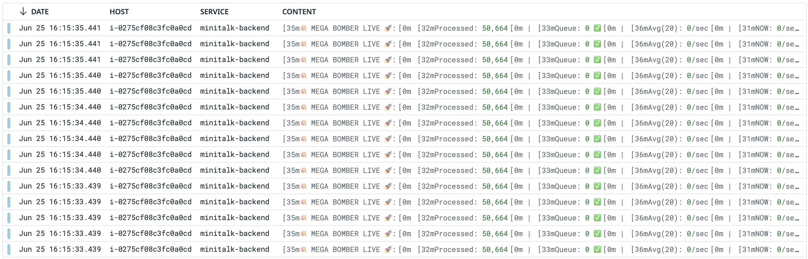

# 감시

이 연수에서는 Datadog의 Monitor 기능을 사용하여 감시를 설정해봅시다.  
slack의 전용 채널(#15th_dev_notification)에 알림을 보낼 수 있게 되어 있습니다.

## 답변

DataDog에서 로그를 성공적으로 확인할 수 있었음

위 이미지와 같이 DataDog의 로그 대시보드에서 애플리케이션의 로그를 실시간으로 모니터링할 수 있었으며, 로그 레벨별로 필터링하고 검색 기능을 통해 특정 로그를 찾을 수 있었음
