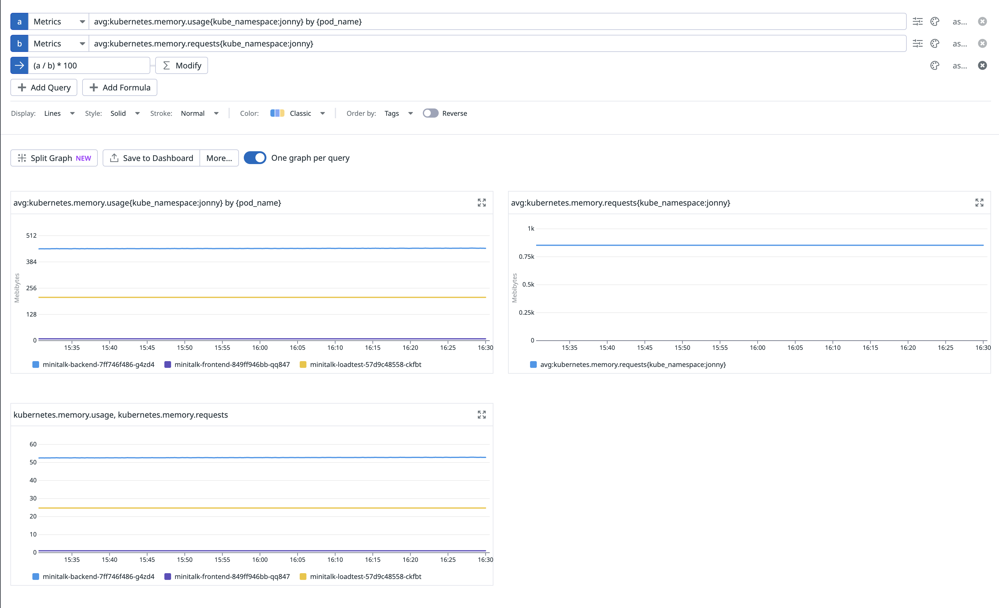
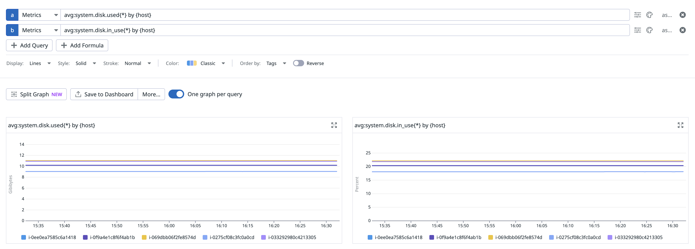
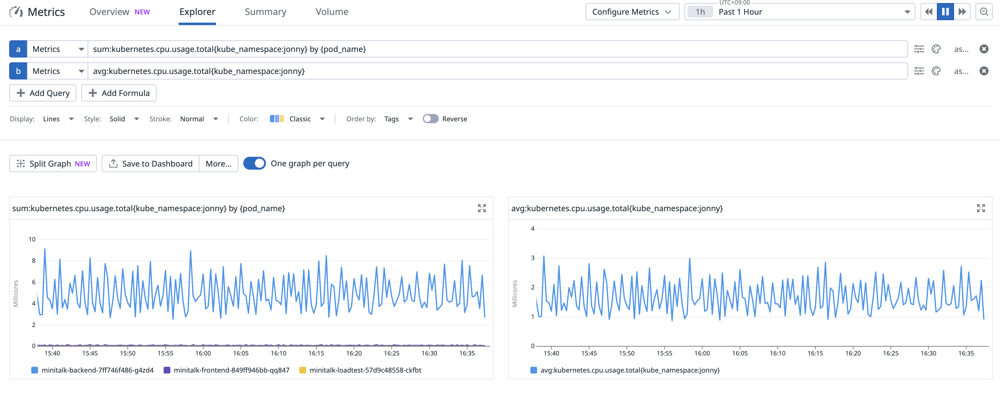
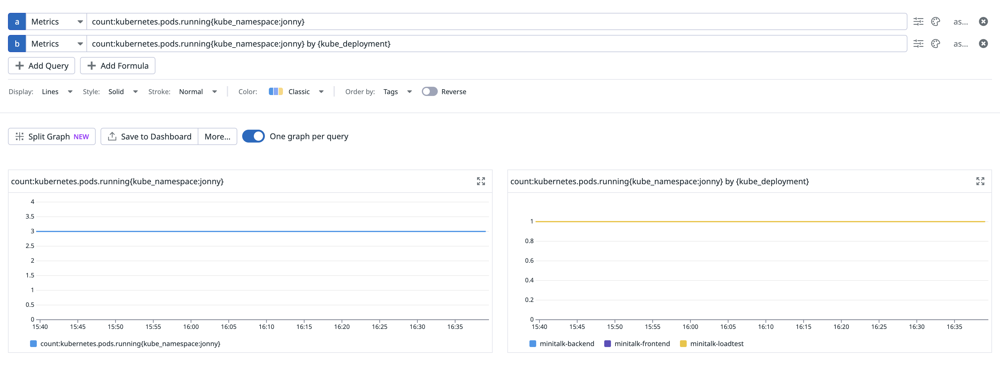
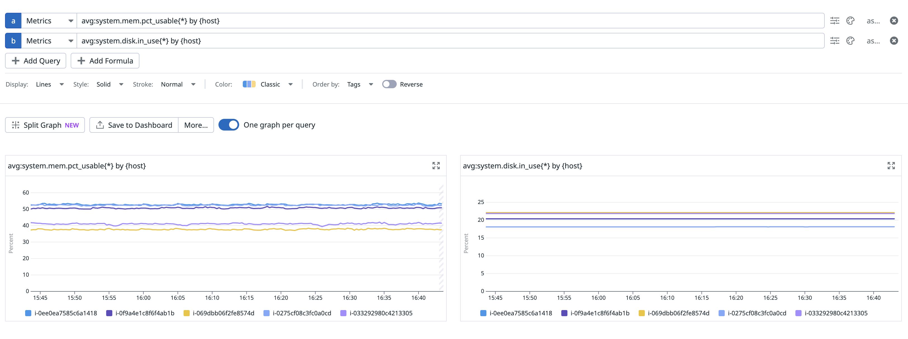

# 메트릭

## 1.1. 메트릭을 살펴보자

각 노드에는 Datadog Agent가 설치되어 있고, 메트릭 수집 설정이 활성화되어 있습니다.
다음 질문에 답해봅시다

- 당신이 배포한 Pod의 각 컨테이너에 할당된 메모리는 충분합니까?
- 당신의 k8s 클러스터를 구성하는 노드의 스토리지는 시간이 경과해도 부족하지 않습니까?
- 당신이 배포한 Pod는 그 노드의 CPU 시간을 어느 정도 비율로 사용하고 있습니까?
- 당신이 배포한 Pod의 수는 어떻게 추이하고 있습니까?
- 당신의 k8s 클러스터를 구성하는 노드는 어떻게 추이하고 있습니까?

## 답변

### 1. 당신이 배포한 Pod의 각 컨테이너에 할당된 메모리는 충분합니까?

**현재 상황:**
- **Backend**: 412Mi 사용 / 1Gi 요청 / 2Gi 제한 → **충분함** (52% 사용)
- **Frontend**: 5Mi 사용 / 512Mi 요청 / 1Gi 제한 → **매우 충분함** (1% 사용)
- **Loadtest**: 207Mi 사용 / 1Gi 요청 / 2Gi 제한 → **충분함** (24% 사용)

### 2. 당신의 k8s 클러스터를 구성하는 노드의 스토리지는 시간이 경과해도 부족하지 않습니까?

**현재 상황:**
- **전체 노드**: 각각 ~50GB 스토리지 용량
- **사용 가능**: 각각 ~44GB 
- **현재 사용률**: 약 12%

**스토리지는 충분함**

**Datadog 쿼리:**

### 3. 당신이 배포한 Pod는 그 노드의 CPU 시간을 어느 정도 비율로 사용하고 있습니까?

**현재 상황:**
- **minitalk 총 CPU 사용량**: 6m (Backend 5m + Frontend 1m + Loadtest 0m)
- **전체 클러스터 CPU 사용량**: 451m
- **minitalk CPU 점유율**: 약 **1.3%**

**Datadog 쿼리:**

### 4. 당신이 배포한 Pod의 수는 어떻게 추이하고 있습니까?

**현재 상황:**
- **총 3개 파드** (Backend 1개, Frontend 1개, Loadtest 1개)
- **모든 파드가 Running 상태**
- **재시작 횟수**: 0회 (안정적)

**Datadog 쿼리:**

### 5. 당신의 k8s 클러스터를 구성하는 노드는 어떻게 추이하고 있습니까?

**현재 상황:**
- **총 5개 노드** 모두 Ready 상태
- **노드 리소스 사용률**:
  - CPU: 4-5% (매우 낮음)
  - 메모리: 48-68% (보통)

**Datadog 쿼리:**

