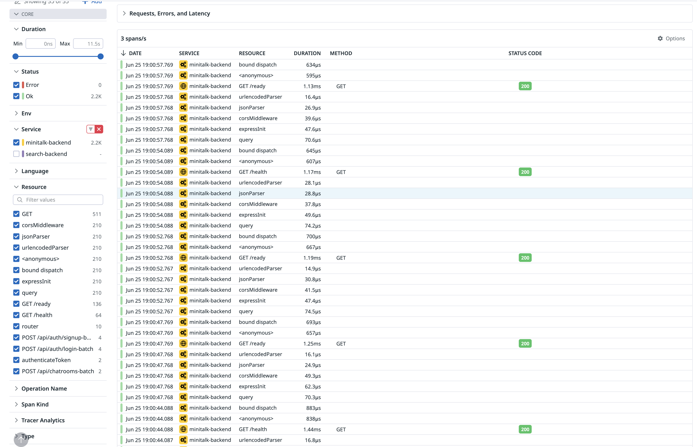

# 트레이스

## 3.1. 트레이스를 출력해보자

OTel 에코시스템의 SDK를 사용하여 트레이스를 출력해봅시다.

https://opentelemetry.io/docs/languages/ruby/

각 언어에 대응한 SDK가 제공되고 있습니다. 튜토리얼도 제공되고 있기 때문에 이를 따라 진행하는 것이 좋을 것입니다.

## 답변

### 3.1. 트레이스 출력 ✅
OpenTelemetry Node.js SDK를 사용하여 `minitalk-backend` 서비스에 트레이싱을 구현했습니다.

위 이미지와 같이 OpenTelemetry SDK를 통해 생성된 트레이스가 성공적으로 출력되었습니다.

